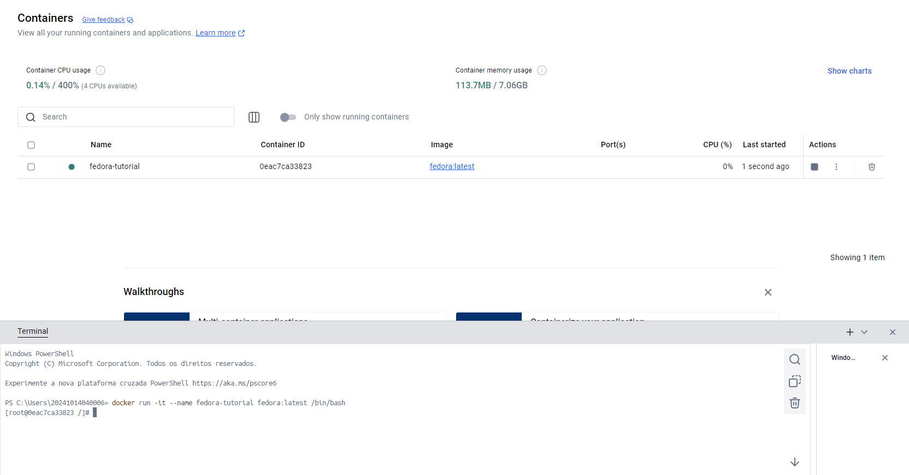
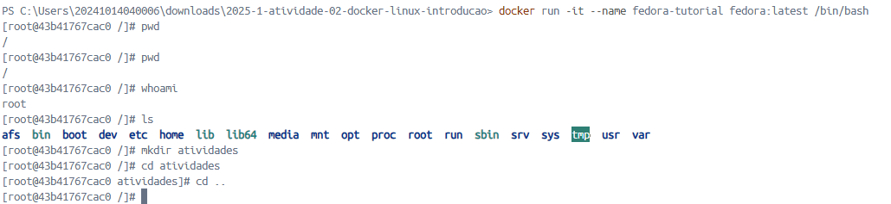
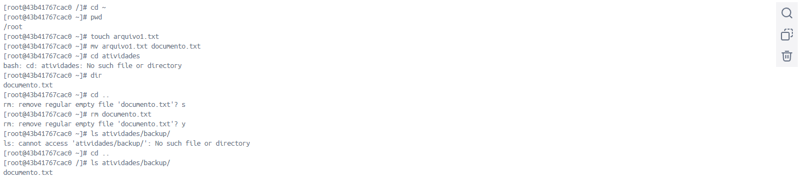
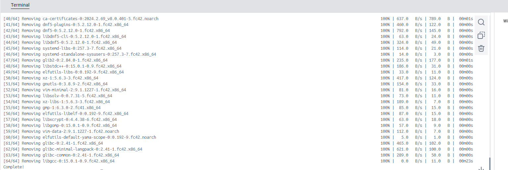
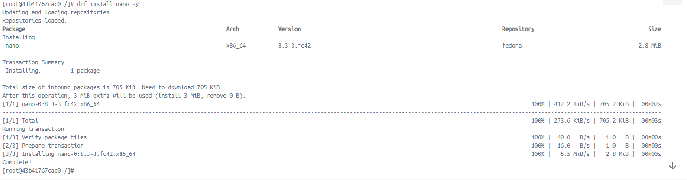
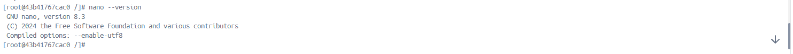
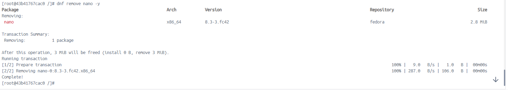
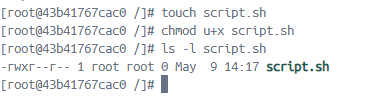
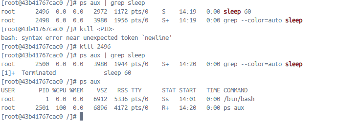
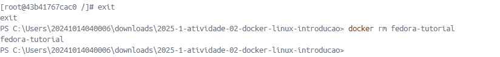

Cabeçalho: título da atividade, nome, data
Introdução: objetivo do exercício
Relato: descreva as suas atividades e mostre os resultados com as imagens capturadas
Conclusão: O que aprendeu? Dificuldades?

# Relatório de Introdução ao Linux usando Docker no Windows
Nome: Gustavo Maia Militão
Data: 09/05/2025

## Introdução
O objetivo desse exercício é utilizar comandos básicos do Linux em um contêiner Docker baseado no Fedora. 

## Relato

### 1. Iniciar um contâiner Fedora
Inicialmente, utilizando o comando abaixo, nós criamos o container com a imagem do Fedora

```
docker run -it --name fedora-tutorial fedora:latest /bin/bash
```


### 2. Navegação básica
Em seguida, fizemos uma navegação básica pelo terminal:
- Verificamos o diretório atual
- Listagem de arquivos
- Criação de pastas
- Entrar em pastas 
- Voltar para pastas anteriores



### 3. Manipulação de arquivos
Na etapa seguinte, focamos em fazer a manipulação de arquivos, criar, copiar, mover, e excluir arquivos. Criamos um arquivo.txt, mudamos o nome para: *documento.txt*, fizemos uma cópia para outra pasta, e por fim excluímos o arquivo original.



### 4. Gerenciamento de pacotes
Nesta etapa, o foco foi realizar operações de instalação de pacotes. O procedimento foi o seguinte:

1. Atualizamos os pacotes presentes no contâiner


2. Instalamos o editor de texto *nano*


3. Vemos a versão do *nano* instalado


4. Por fim, desinstalamos o *nano* 


### 5. Permissões dos arquivos
Neste momento, buscamos compreender como é feito a modificação da permissão dos arquivos. Criamos um arquivo.sh, demos a permissão de execução usando *chmod u+x script.sh*, e por fim verificamos as permissões. Não pude compreender muito bem em relação a termos de execução, quem possui a execução do arquivo ou não.



### 6. Processos em execução
Nesta etapa, buscamos analisar os processos em execução: 
- Listando os processos
- Executando um processo em segundo plano
- Buscando o PID dos processos
- Encerrando



### 7. Encerrando o contâiner
Por fim, finalizamos a atividade saindo, e fechando o contâiner.



### Conclusão
Com esse exercício, pude reforçar mais as minhas habilidades usando Docker, como o uso do *pwd* que nunca havia utilizado antes me experiência profissional. 

Além disso, é evidente o quão prático é usar o terminal Linux, mas uma dificuldade que tive foi o retorno de respostas, como por exemplo, ao remover um arquivo, nada me retorna, se não dar um *ls* na pasta ver os arquivos presentes. 